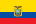
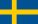
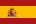
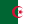
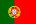
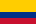

# Sistema Elo

PT-BR | [English](#english)

Este documento explica a logica do motor de simulacao usado no projeto principal.

Para a visao geral do repositorio, instalacao e comandos de uso, veja [../README.md](../README.md).

## Grupos / Groups

Passe o mouse sobre cada bandeira para ver o nome da selecao, se o renderizador suportar `title`. Hover over each flag to see the team name when the renderer supports `title`.

| Grupo | Time 1 | Time 2 | Time 3 | Time 4 |
| --- | --- | --- | --- | --- |
| A |  |  |  |  |
| B |  |  |  |  |
| C |  |  |  |  |
| D |  |  |  |  |
| E |  |  |  |  |
| F |  |  |  |  |
| G |  |  |  |  |
| H |  |  |  |  |
| I |  |  |  |  |
| J |  |  |  |  |
| K |  |  |  |  |
| L |  |  |  |  |

## PT-BR

### O que esta nesta pasta

Esta pasta concentra a implementacao do simulador:

- `Simulator.py`: organiza a Copa, executa grupos e mata-mata, e salva o resultado final.
- `Group.py`: roda as partidas da fase de grupos e define a classificacao.
- `Match.py`: calcula probabilidades, sorteia placares e decide confrontos eliminatorios.
- `Team.py`: representa cada selecao e seus atributos temporarios de campanha.
- `App.py`: apresenta os resultados em uma interface Streamlit.
- `resultado.json`: arquivo gerado com o acumulado das simulacoes.

As bandeiras exibidas pela interface sao carregadas a partir dos arquivos da pasta `../bandeira/`, com imagens baseadas no Flagcdn: https://flagcdn.com/

### Como abrir a interface Streamlit

O arquivo `App.py` nao e executado como um script Python comum. Ele deve ser iniciado com o Streamlit a partir da raiz do projeto:

```bash
python -m streamlit run sistema_elo/App.py
```

Fluxo recomendado:

1. Ative o ambiente virtual.
2. Instale as dependencias com `pip install -r requirements.txt`.
3. Gere `resultado.json` com `python sistema_elo/Simulator.py`.
4. Rode `python -m streamlit run sistema_elo/App.py`.

Depois disso, o Streamlit disponibiliza a interface em uma URL local, normalmente `http://localhost:8501`.

### Como o modelo funciona

O simulador usa uma expectativa de resultado baseada na diferenca de pontos entre duas selecoes:

```text
expectativa_time1 = 1 / (1 + 10 ^ ((pontos_time2 - pontos_time1) / 600))
```

Em seguida, o codigo estima a chance de empate conforme a distancia entre os ratings:

- diferenca ate 50: 30%
- diferenca ate 100: 25%
- diferenca ate 200: 20%
- diferenca ate 300: 15%
- acima de 300: 10%

Com isso, o resultado final de cada jogo e distribuido entre:

- vitoria do time 1
- empate
- vitoria do time 2

Os placares sao sorteados a partir de conjuntos fixos de resultados provaveis, por exemplo `1x0`, `2x1`, `3x1`, `3x0` para vitorias e `0x0`, `1x1`, `2x2` para empates.

### Regras do torneio implementadas

- 48 selecoes divididas em 12 grupos.
- Todos jogam entre si dentro do grupo.
- Classificacao do grupo por pontos, saldo de gols, gols marcados e ranking.
- Avancam os 2 melhores de cada grupo.
- Os 8 melhores terceiros colocados completam os 32 classificados.
- No mata-mata, empates sao resolvidos por uma escolha aleatoria que representa disputa por penaltis.

### Fluxo de execucao

1. `Simulator.py` carrega `../teams.json`, que agora contem apenas as 48 selecoes definidas nos grupos atuais.
2. Os grupos sao montados manualmente no codigo.
3. Cada grupo executa suas partidas e retorna a classificacao.
4. O simulador monta os classificados para o mata-mata.
5. Cada fase eliminatoria registra quem caiu em `resultado.json`.
6. O campeao recebe o marcador final de titulo.
7. `App.py` le `resultado.json` e exibe os dados no dashboard.

### Leitura do resultado

Os campos numericos em `resultado.json` representam ate onde cada selecao chegou:

- `32`: classificou para o mata-mata
- `16`: chegou as oitavas
- `8`: chegou as quartas
- `4`: chegou a semifinal
- `2`: vice-campeao
- `1`: campeao

Esses valores sao exibidos diretamente na interface em `App.py`.

---

## English

### What this folder contains

This folder contains the simulation engine used by the main project:

- `Simulator.py`: builds the tournament, runs group and knockout stages, and saves the final output.
- `Group.py`: runs the group-stage matches and computes standings.
- `Match.py`: calculates match probabilities, samples scorelines, and decides knockout rounds.
- `Team.py`: represents each national team and its temporary tournament state.
- `App.py`: displays the results through Streamlit.
- `resultado.json`: generated file with aggregated simulation results.

The flags shown in the interface are loaded from the `../bandeira/` folder, using images based on Flagcdn: https://flagcdn.com/

### How to open the Streamlit interface

`App.py` is not meant to be started as a regular Python script. It should be launched with Streamlit from the project root:

```bash
python -m streamlit run sistema_elo/App.py
```

Recommended flow:

1. Activate the virtual environment.
2. Install dependencies with `pip install -r requirements.txt`.
3. Generate `resultado.json` with `python sistema_elo/Simulator.py`.
4. Run `python -m streamlit run sistema_elo/App.py`.

After that, Streamlit serves the interface on a local URL, usually `http://localhost:8501`.

### How the model works

The simulator uses an Elo-style expectation based on the difference between two teams' FIFA points:

```text
team1_expectation = 1 / (1 + 10 ^ ((team2_points - team1_points) / 600))
```

Then it assigns a draw probability according to the distance between the ratings:

- difference up to 50: 30%
- difference up to 100: 25%
- difference up to 200: 20%
- difference up to 300: 15%
- above 300: 10%

That probability split is used to sample one of three outcomes:

- team 1 win
- draw
- team 2 win

Scorelines are sampled from fixed sets of likely outcomes, such as `1x0`, `2x1`, `3x1`, `3x0` for wins and `0x0`, `1x1`, `2x2` for draws.

### Tournament rules implemented here

- 48 national teams split into 12 groups.
- Round-robin play inside each group.
- Group ranking based on points, goal difference, goals scored, and ranking.
- Top 2 teams from each group advance.
- The 8 best third-placed teams complete the round of 32.
- In knockout rounds, draws are resolved by a random choice representing penalties.

### Execution flow

1. `Simulator.py` loads `../teams.json`, which now contains only the 48 teams defined in the current groups.
2. Groups are manually defined in code.
3. Each group runs its schedule and returns the standings.
4. The simulator builds the knockout field.
5. Each knockout round records the eliminated teams in `resultado.json`.
6. The champion receives the final title marker.
7. `App.py` reads `resultado.json` and renders the dashboard.

### Reading the output

The numeric keys in `resultado.json` map to the deepest stage reached by each team:

- `32`: qualified for the knockout bracket
- `16`: reached the round of 16
- `8`: reached the quarterfinals
- `4`: reached the semifinals
- `2`: runner-up
- `1`: champion

Those counters are rendered directly by `App.py`.
